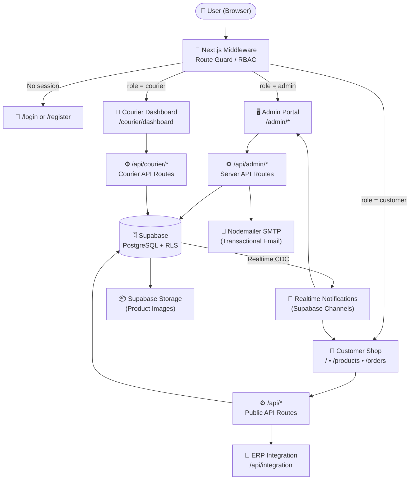
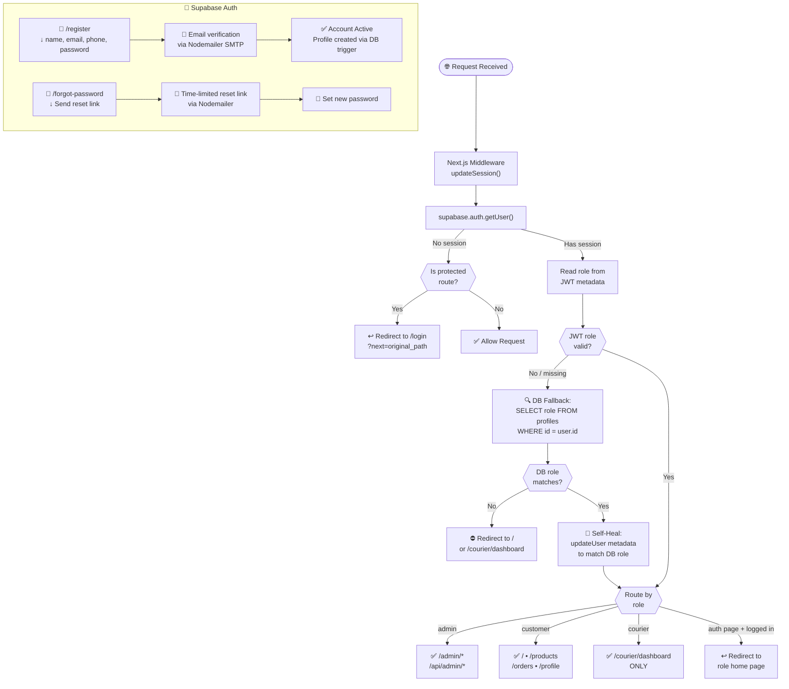
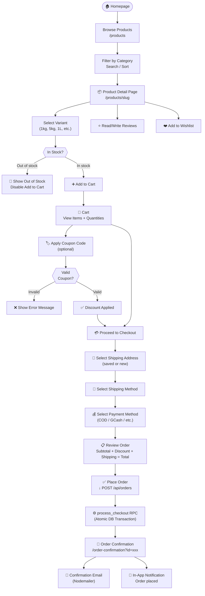
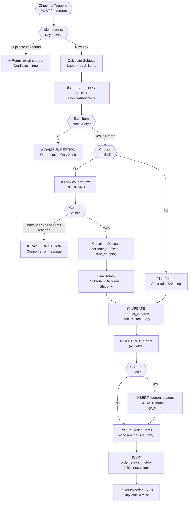
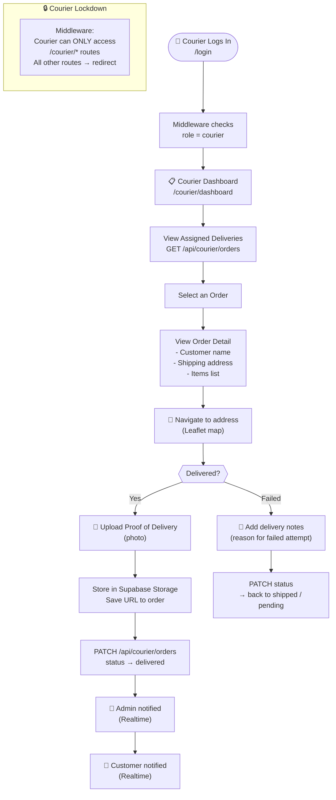
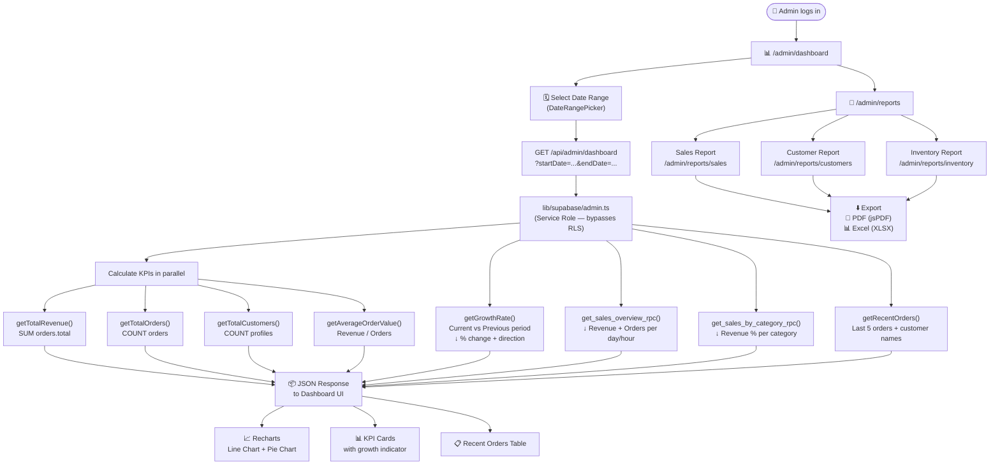
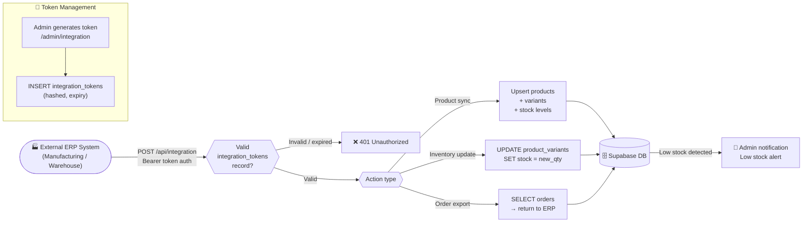
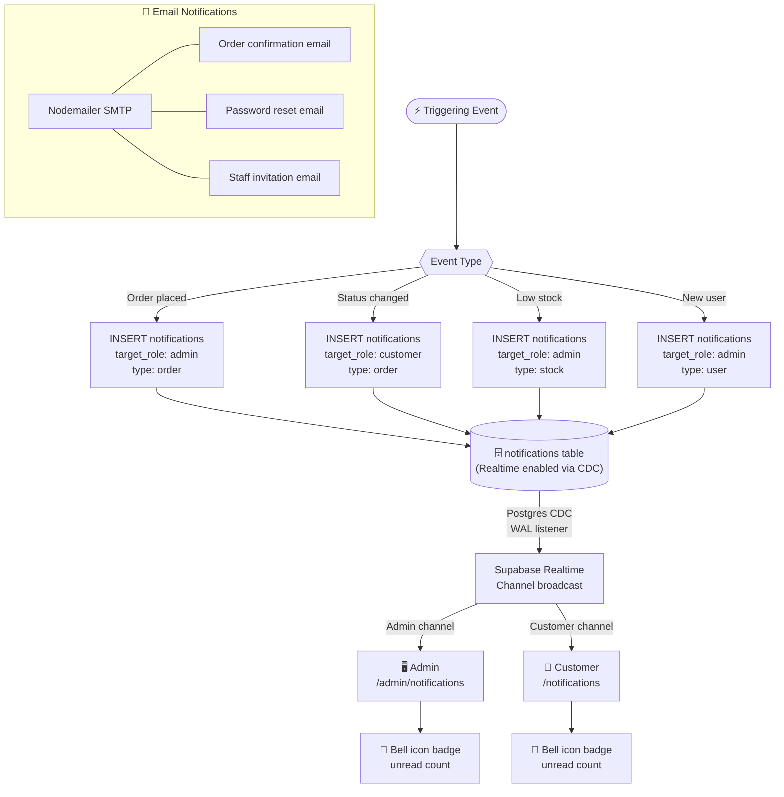
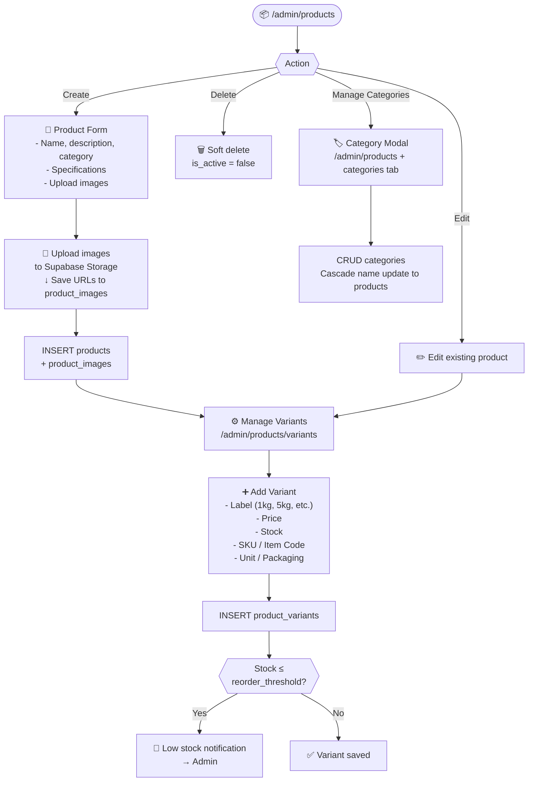

# 📊 System Flowcharts — Never Stop Dreaming Trading
**Capstone Project | Full System Flow Documentation**

---

## 1. Overall System Architecture Flow

---

## 2. User Authentication & Role Routing

---

## 3. Customer Shopping Flow

---

## 4. Atomic Checkout RPC Flow (`process_checkout`)

---

## 5. Admin Order Management Lifecycle

```mermaid
flowchart LR
    Placed(["📬 Order Placed\nstatus: pending"]) --> AdminView["Admin views order\n/admin/orders"]

    AdminView --> Confirm["Admin confirms payment\nstatus → processing"]
    Confirm --> PrepareShip["Admin prepares shipment\nAssign courier + tracking #"]
    PrepareShip --> Ship["Mark as Shipped\nstatus → shipped"]

    Ship --> CourierDeliver["🚚 Courier delivers\nUploads proof photo"]
    CourierDeliver --> MarkDelivered["status → delivered\ndeliveredAt = NOW()"]

    MarkDelivered --> CustomerConfirm{{"Customer\nconfirms receipt?"}}
    CustomerConfirm -->|"Yes (manual)"| Completed["✅ status → completed\nconfirmedByCustomerAt = NOW()"]
    CustomerConfirm -->|"No (timeout)"| CronJob["⏰ /api/cron\nAuto-confirm after X days"]
    CronJob --> AutoComplete["✅ status → completed\nautoConfirmed = true"]

    Completed --> ReviewPrompt["⭐ Customer prompted\nto rate & review"]
    ReviewPrompt --> ReviewSubmit["Review submitted\n(status: pending)"]
    ReviewSubmit --> AdminMod["Admin moderates review\n/admin/cms"]
    AdminMod -->|"Approve"| Published["✅ Review published\nProduct rating updated"]
    AdminMod -->|"Reject"| Rejected["❌ Review rejected"]

    AdminView --> Cancel["❌ Admin cancels order\nstatus → cancelled"]

    subgraph "📋 Status History"
        SH["Every status change\nINSERT → order_status_history\n(old_status, new_status, notes, timestamp)"]
    end
```

---

## 6. Courier Delivery Flow

---

## 7. Admin Dashboard & Reporting Flow

---

## 8. ERP Integration Flow

---

## 9. Notification System Flow

---

## 10. Product Management Flow (Admin)

